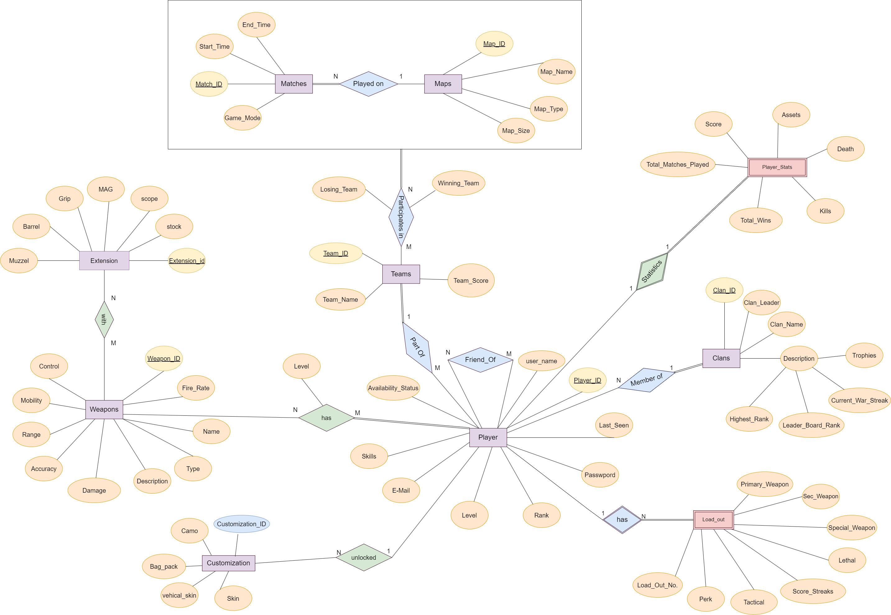
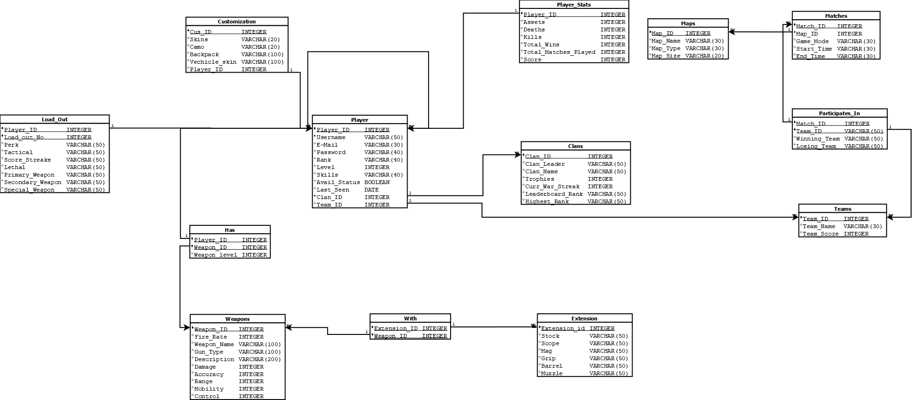

# Special Ops - COD Analyzer Mini World

## 👥 Team Information
**Team ID:** T207  
**Project Members:**
- Vegad Rutvik (202201143) – *Group Representative*
- Ramani Janvi (202201158)
- Brahmbhatt Krisha (202201164)
- Savani Vedant (202201178)

---

## 🎯 Objective

**Special Ops** is a database project centered around *Call of Duty Mobile (CODM)*. The platform is designed to store and analyze comprehensive match data, allowing for deep insights into player performance, strategy, customization, and social interaction. It aims to support India’s growing gaming ecosystem with a structured, normalized relational schema for game data management.

---

## 🛠️ Goals

1. **Centralized Information Hub**  
   Repository for game data: player stats, maps, weapons, clans, matches, etc.

2. **Enhanced Gameplay Experience**  
   Help players understand performance trends and improve their strategies.

3. **User-Friendliness**  
   Designed for easy access and use by both beginners and professional gamers.

---

## 🧠 System Design

### 📈 ER Diagram


### 📘 Relational Schema


---

## 📦 Schema Overview

Database Name: `t207`

### Key Tables:

- **Player**: Player details like username, email, rank, level, clan/team affiliation
- **Clans**: Clan data such as leader, name, trophies, and rank
- **Teams**: Multiplayer team details
- **Player_stats**: Kills, deaths, assets, score
- **Weapons & Extensions**: Attributes of weapons and attachments
- **Load_out**: Loadouts used by players including weapons and gear
- **Matches**: Match records including game mode, map, start/end time
- **Maps**: Map names, types, and sizes
- **Customization**: Player appearance customization
- **Relationships**: Foreign keys like `Participates_in`, `Has`, `With` manage many-to-many mappings

Refer to [`DDL_script.txt`](DDL_script.txt) for full schema creation.

---

## 🔍 Functional Dependencies & Normalization

Each table is normalized to **BCNF**, with minimal FDs and proof included in the [`Functional Dependencies.pdf`](Functional%20Dependencies.pdf).

Example:  
**Player Table**  
`Player_ID → Username, Email, Password, Rank, ...`  
Thus, `Player_ID` is a superkey ⇒ Table in BCNF

---

## 🧪 Sample Data

Player, Clan, Map, Weapon, Match, and Participation data is preloaded.  
Refer to [`Insertion_script.txt`](Insertion_script.txt) for complete sample entries.

---

## 📋 Sample SQL Queries

Available in [`Sample_Queries.txt`](Sample_Queries.txt). Examples include:

- Top 10 players by kills  
- Most used weapons  
- Clans with the highest war streaks  
- Players with higher scores than their clan leaders  
- Players who used all weapons

```sql
-- Example: Top 10 players by score
SELECT * FROM Player_stats ORDER BY Score DESC LIMIT 10;
```

---

## 🧾 Project Features

- 🔑 **Login Module**: via COD/Google/Facebook login  
- 🎮 **Match & Mode Selection**: Multiplayer, BR, Ranked  
- 🗺️ **Map Management**: With types & sizes  
- 🔫 **Weapon Loadout & Customization**: With skins, perks, attachments  
- 🧍 **Clan & Team Affiliations**: For group play and stats tracking  
- 🔢 **Statistical Insights**: Player performance, win ratio, asset tracking  
- 🤝 **Friend Connectivity**: Add and play with friends  
- 🎯 **Tier-Based Matchmaking**: Balanced competition

---

## 🚀 How to Run

1. Use PostgreSQL and PGAdmin/CLI to create the schema:
    ```sql
    \i DDL_script.txt
    \i Insertion_script.txt
    ```

2. Run queries from `Sample_Queries.txt` to analyze the data.

3. Optional: Use Python/Java/PHP frontend for UI + PostgreSQL backend.

---

## 📄 Report

For a detailed write-up on design, normalization, ERD, schema, and objectives, refer to [`T207_special_ops.pdf`](T207_special_ops.pdf).

---

## 🙌 Acknowledgement

Special thanks to our DBMS course instructors and teammates for collaborative contributions and testing.

---

**Thank You!**
